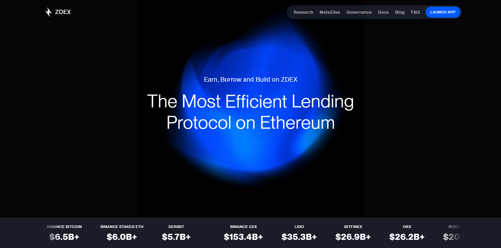
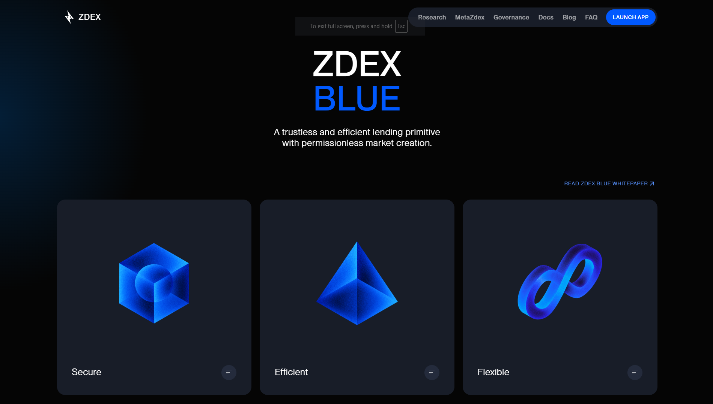
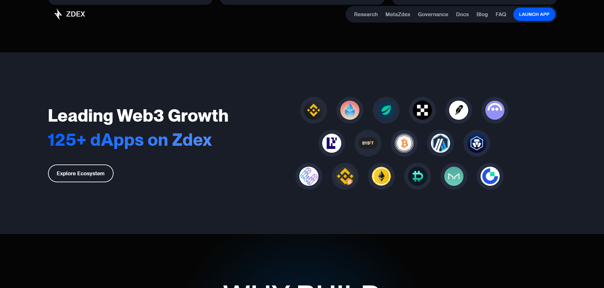
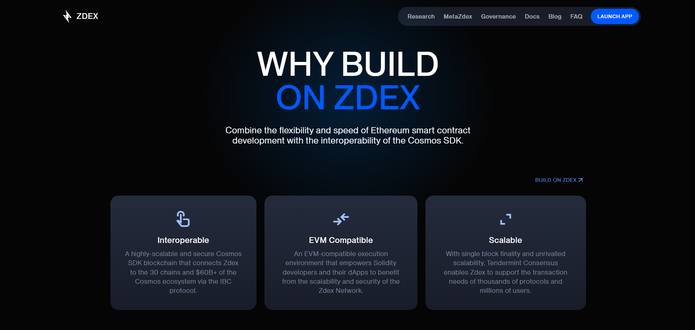
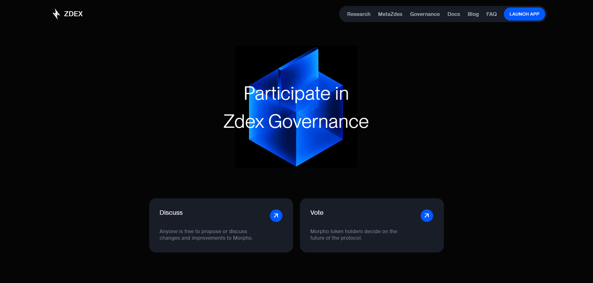
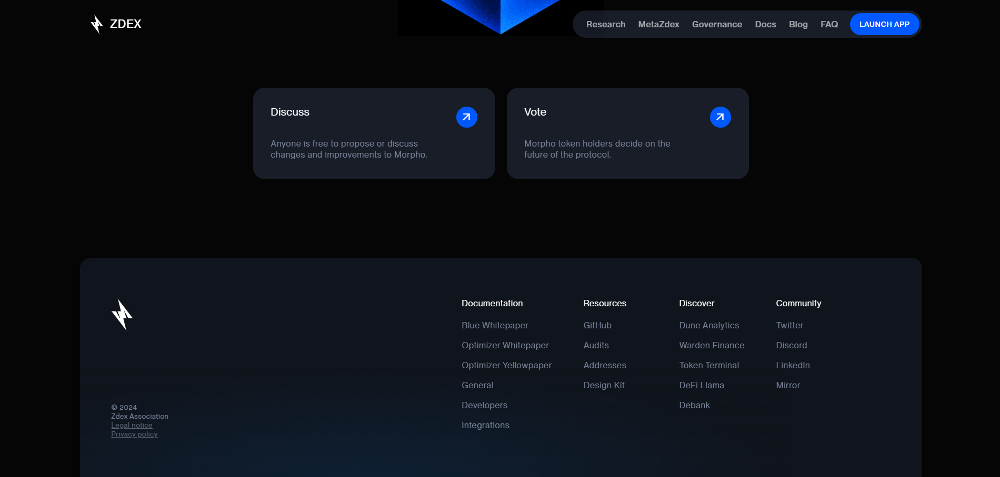

# Zdex Landing Page
Final project in Web Design for Crypto project. End of Web Design module of Semester II at VKU.

## 📃Demo
<p>
  
  
</p>
<p>
  
  
</p>
<p>
  
  
</p>

## 🛠️ Built with
- HTML5
- CSS3
- SASS v1.77.1
- Javascript

## ⚙️ Installation
```bash
git clone https://github.com/iamzoohuy/zdexLandingPage.git
```

## 👉 Usage
Browse to the directory you cloned. Then open the `index.html` file.

## 🫂 Contributing
If you'd like to contribute, fork the repository and use a feature branch.

## 📄 License

## 🥹 Acknowledgments
I'm looking forward to receiving feedback as I develop further. Thanks for viewing my project ✨.

## ✨ Support
Give a ⭐ if this project helped you!<br><br>
<a href='https://www.buymeacoffee.com/zoohuyvn' target='_blank'></a>
